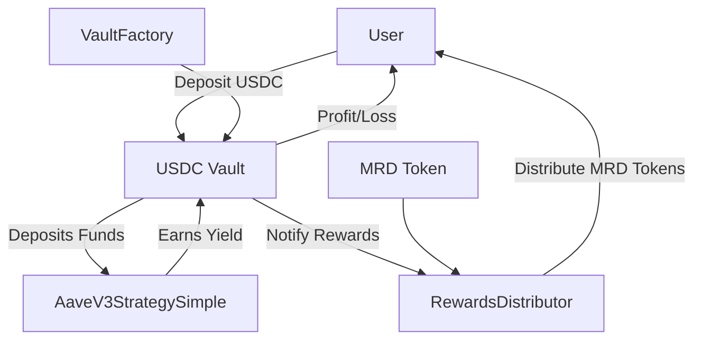

## Meridian Protocol - Decentralized Treasury and Yield System

A suite of smart contracts for a governance-enabled token, a yield-bearing vault, and a rewards distribution system.

[](https://soliditylang.org/)
[](https://getfoundry.sh/)
[](https://opensource.org/licenses/MIT)
[](https://github.com/Enricrypto/meridian-finance-yield-farming/test)

## 🌟 Overview

The Meridian Protocol is designed to manage a yield-generating system. It consists of a **governance token** (`MeridianToken`), a **DeFi vault** (`MeridianVault`) inspired by ERC4626 for yield generation, and a **rewards distributor** (`RewardsDistributor`) to incentivize vault users. A **factory contract** (`VaultFactory`) handles the creation and management of multiple vaults.

## 🎯 Technical Highlights

**What powers the Meridian Protocol:**

- **Modular Architecture**: Separation of concerns between token, vault, factory, and rewards system for upgradeability and security.
- **ERC-4626 Inspired Vaults**: Utilizes a share-based accounting system for accurate yield tracking and distribution (as seen by `previewDeposit`, `previewWithdraw`, `totalAssets` in `MeridianVault`).
- **External Strategy Integration**: The vault uses external strategies (`AaveV3StrategySimple`) for yield generation, allowing for dynamic adaptation to DeFi opportunities.
- **Role-Based Access Control**: Functions like `addMinter` (Token), `setStrategy` (Vault), and administrative functions are protected by ownership or role checks.
- **Gas Optimization**: Contract sizes are generally small, indicating efficient code design.

### Key Components

- **MeridianToken**: The primary ERC20 token, featuring minting control.
- **MeridianVault**: The user-facing contract for depositing assets and earning yield, adhering closely to the Vault standard pattern.
- **RewardsDistributor**: Manages the staking/yield rewards, allowing users to `claim` rewards generated from the vault's yield or external sources.
- **VaultFactory**: Creates and tracks new instances of `MeridianVault` for different underlying assets or strategy configurations.
- **AaveV3StrategySimple**: A specific yield strategy integrating with the Aave V3 lending protocol.

---

## 🏗️ Architecture



The system follows a modular, **Factory-Vault-Strategy** structure, a highly composable and secure pattern in modern DeFi. The `VaultFactory` acts as the single point of truth and deployment for yield-bearing `MeridianVaults`, which interact with external protocols via modular `Strategy` contracts.

### System Flow (Deposit)

1.  **User** calls `MeridianVault.deposit(assetAmount)`.
2.  **MeridianVault** transfers `assetAmount` from the user.
3.  **MeridianVault** calculates the equivalent number of shares using the `assetsPerShare` rate.
4.  **MeridianVault** mints the calculated shares to the user.
5.  **MeridianVault** calls its active `Strategy.deposit()` to deploy the newly added assets to an external protocol (e.g., Aave).

### Core Contracts

| Contract                       | Role                    | Key Functions                                   | Dependencies         |
| :----------------------------- | :---------------------- | :---------------------------------------------- | :------------------- |
| **`VaultFactory.sol`**         | **Deployment/Registry** | `createVault`, `getAllVaults`                   | Ownable              |
| **`MeridianToken.sol`**        | **Protocol Token**      | `mint`, `addMinter`, `transfer`                 | ERC20, AccessControl |
| **`MeridianVault.sol`**        | **ERC-4626 Vault**      | `deposit`, `withdraw`, `harvest`, `setStrategy` | ERC4626, IStrategy   |
| **`AaveV3StrategySimple.sol`** | **Yield Strategy**      | `deposit`, `withdraw`, `totalAssets`            | Aave Interfaces      |
| **`RewardsDistributor.sol`**   | **Incentives**          | `claim`, `earned`, `notifyDeposit`              | IToken, IVault       |

---

## 🧪 Testing Strategy

The project utilizes **Foundry's Forge** for comprehensive unit and integration testing, following the **test-driven development (TDD)** approach for all critical financial logic.

### Testing Tools & Principles

- **Foundry**: Used for speed, gas optimization, and native Solidity testing.
- **Fuzzing**: Applied to all key financial functions (`deposit`, `withdraw`, `harvest`) to test edge cases, large numbers, and rounding errors.
- **EVM Cheats**: Utilizes Foundry's cheatcodes (`vm.warp`, `vm.roll`, `vm.deal`) to simulate time passage, block height changes, and token balances accurately.
- **Fork Testing**: Critical integration tests use a **Mainnet fork** to test the `AaveV3StrategySimple` against real-world protocols and state.

### Test Coverage (Target: 95%+)

| Test Suite                   | Focus Area         | Description                                                                                                                                        |
| :--------------------------- | :----------------- | :------------------------------------------------------------------------------------------------------------------------------------------------- |
| **`TokenTest.t.sol`**        | Unit               | Access control for minters, standard ERC20 behavior.                                                                                               |
| **`VaultFactoryTest.t.sol`** | Unit               | Correct vault deployment, ownership transfer, and registry accuracy.                                                                               |
| **`VaultTest.t.sol`**        | Unit & Integration | **Full ERC-4626 compliance** (e.g., `previewDeposit`, `convertToShares`), strategy setting, emergency pause.                                       |
| **`StrategyTest.t.sol`**     | Integration/Fork   | Deposits/withdrawals to the **Aave V3 protocol**, accurate asset tracking, and yield harvesting.                                                   |
| **`DistributorTest.t.sol`**  | Unit & Integration | Correct rewards calculation (`earned`) and distribution (`claim`) based on time and shares.                                                        |
| **`FullFlow.t.sol`**         | End-to-End         | Simulates a multi-user, multi-step flow: Deposit $\rightarrow$ Time warp $\rightarrow$ Harvest $\rightarrow$ Withdraw $\rightarrow$ Claim Rewards. |

---

## 🔒 Security Features

### Implemented Protections

- ✅ **Role-Based Access Control**: Strict `onlyOwner` or designated minter/admin checks on all configuration and state-changing administrative functions.
- ✅ **Reentrancy Protection**: Guard against reentrancy on all external calls, especially within `deposit` and `withdraw` in the Vault.
- ✅ **SafeERC20**: Used for all token interactions to prevent token-related edge case vulnerabilities.
- ✅ **ERC-4626 Standardization**: Inheriting from this standard significantly reduces the risk of common vault accounting errors (like first depositor attack, which is solved by the standard's implementation).
- ✅ **Pausable Functionality**: The `pauseDeposits` functionality in `MeridianVault` provides a circuit breaker for emergency situations.

### Attack Vectors Considered

- Reentrancy on external calls to the strategy.
- ERC-4626 rounding and precision loss during share conversion.
- Unauthorized minting of `MeridianToken`.
- Unintended asset loss during strategy switching.

---

## 🚀 Getting Started

### Prerequisites

```bash
# Install Foundry (if not already installed)
curl -L https://foundry.paradigm.xyz | bash
foundryup
```

### Installation

```bash
# Clone the repository
git clone https://github.com/MeridianProtocol/meridian-protocol.git # Hypothetical repo name
cd meridian-protocol

# Install dependencies
forge install

# Build contracts
forge build
```

### Testing & Gas Reporting

```bash
# Run all tests (assumes tests are comprehensive)
forge test

# Generate a detailed gas report
forge test --gas-report
```

---

## ⛽ Gas Benchmarks

### `src/MeridianToken.sol:MeridianToken Contract`

| Metric    | Deployment Cost (Gas) | Deployment Size (Bytes) |
| :-------- | :-------------------- | :---------------------- |
| **Value** | **1,997,640**         | **11,530**              |

| Function Name | Min (Gas) | Avg (Gas)  | Max (Gas) | \# Calls | **Description**                 |
| :------------ | :-------- | :--------- | :-------- | :------- | :------------------------------ |
| `mint`        | 24,054    | **65,453** | 66,114    | 260      | Adds new tokens to circulation. |
| `transfer`    | 33,350    | **55,710** | 56,182    | 257      | Standard token transfer.        |

---

### `src/MeridianVault.sol:MeridianVault Contract`

| Metric    | Deployment Cost (Gas) | Deployment Size (Bytes) |
| :-------- | :-------------------- | :---------------------- |
| **Value** | **1,931,834**         | **9,519**               |

| Function Name | Min (Gas) | Avg (Gas)   | Max (Gas) | \# Calls | **Description**                                   |
| :------------ | :-------- | :---------- | :-------- | :------- | :------------------------------------------------ |
| `deposit`     | 29,270    | **157,613** | 225,252   | 1,348    | User deposits assets for shares/yield.            |
| `harvest`     | 28,726    | **139,064** | 140,402   | 265      | Claims strategy yield and re-invests/distributes. |
| `withdraw`    | 51,464    | **77,659**  | 104,932   | 531      | User burns shares to withdraw assets.             |

---

### `src/VaultFactory.sol:VaultFactory Contract`

| Metric    | Deployment Cost (Gas) | Deployment Size (Bytes) |
| :-------- | :-------------------- | :---------------------- |
| **Value** | **2,666,746**         | **12,228**              |

| Function Name | Min (Gas) | Avg (Gas)     | Max (Gas) | \# Calls | **Description**                                                                       |
| :------------ | :-------- | :------------ | :-------- | :------- | :------------------------------------------------------------------------------------ |
| `createVault` | 23,812    | **1,771,459** | 1,890,191 | 48       | Deploys a new `MeridianVault` instance. (High cost due to multiple deployments/setup) |

---

## ⚠️ Disclaimer

This code is provided as-is for informational and educational purposes. It has not been formally audited. Exercise caution and do not use with real funds in a production environment without a professional security audit.

## 📧 Contact

_\[Insert Contact Information or Acknowledgment Section Here]_

Enricrypto - GitHub

Project Link: https://github.com/Enricrypto/meridian-finance-yield-farming
